<div align="center">
  <h1>⚡ Grid Anomaly Detection & Load Forecasting</h1>
  <p><b>CSE412 Big Data & Large-Scale Computing Applied Project</b></p>
  
  
  
  
  
  
</div>

---

> A fully automated Big Data pipeline processing **167 Million rows (10GB)** of London smart meter data using a localized multi-container Hadoop cluster. 

This project demonstrates a complete ETL and Machine Learning lifecycle: ingesting raw meter readings into **HDFS**, cleaning and transforming with **Apache Pig**, feature engineering via **Apache Hive**, and finally applying Time-Series Forecasting and Anomaly Detection (K-Means & Residuals) using **Spark MLlib**.

## 🏗️ System Architecture

```mermaid
flowchart LR
    %% Define Nodes
    A[(Raw Kaggle\nCSVs)] -->|Ingest| B(HDFS /raw\nDataNode)
    B -->|Clean & Join| C(Apache Pig\nETL Script)
    C -->|Dump| D(HDFS /clean)
    D -->|External Table| E[(Apache Hive\nMetastore)]
    E -->|CTAS & Window| F[(Hive ORC\nPartitioned)]
    F -->|Read| G[Spark MLlib\nForecasting]
    G -->|Extract| H([Dashboard & Results])
    
    %% Formatting
    classDef hdfs fill:#f9f,stroke:#333,stroke-width:2px;
    classDef hive fill:#ff9,stroke:#333,stroke-width:2px;
    classDef spark fill:#9cf,stroke:#333,stroke-width:2px;
    
    class B,D hdfs;
    class E,F hive;
    class G spark;
```



## ✨ Features
* **Automated Data Pipeline:** Real data flow with zero manual copying between stages.
* **Smart Data Sampling:** Built-in `--subset` mode to run complete tests locally in ~10 minutes.
* **Advanced Feature Engineering:** Window functions, lags, and rolling standard deviations calculated efficiently in Hive.
* **Interactive Dashboard:** Explore forecasting errors by demographic (ACORN) and tariff type using the included Streamlit web app.

## 🚀 Quickstart

### 1. Prerequisites
- Docker & Docker Compose (`docker-compose`)
- Python 3 with `pandas`, `scikit-learn`, `matplotlib`, and `streamlit`
- Kaggle dataset `jeanmidev/smart-meters-in-london` (Zipped as `Dataset.zip` in root)

### 2. Launch the Cluster
Bring up the Hadoop, Hive, and Spark containers:
```bash
docker-compose -f docker/docker-compose.yml up -d
```
> *Wait 30-60 seconds for the Hive Metastore initialization to complete.*

### 3. Run the Pipeline
Execute the full end-to-end pipeline (Data Extraction -> HDFS -> Pig -> Hive -> Spark):

**Run on sample subset (Recommended for testing - ~10 mins):**
```bash
./scripts/run_pipeline.sh --subset
```

**Run on full 10GB dataset (Takes 1-2 hours):**
```bash
./scripts/run_pipeline.sh --full
```

## 📊 Interactive Dashboard (New!)
We have included a stunning local web dashboard to explore the results interactively. 

To view the dashboard, run:
```bash
pip install streamlit
streamlit run app.py
```
This will open `http://localhost:8501` in your browser, where you can visualize:
- Forecasting performance (RMSE, MAE, sMAPE) by Hour, Tariff, and Demographic.
- Anomaly Detection plots and insights.
- Overall Hive reporting queries.

## 📂 Project Structure
```text
.
├── app.py                   # Streamlit Interactive Dashboard
├── docker/                  # Dockerfiles and docker-compose configs
├── docs/                    # Architecture diagrams and proposals
├── hive/                    # HQL scripts for feature engineering
├── pig/                     # Pig Latin scripts for ETL cleaning
├── scripts/                 # Bash/Python automation and pipeline scripts
├── spark/                   # Scala scripts for Spark MLlib training
└── results/                 # Final output metrics and CSVs
```
